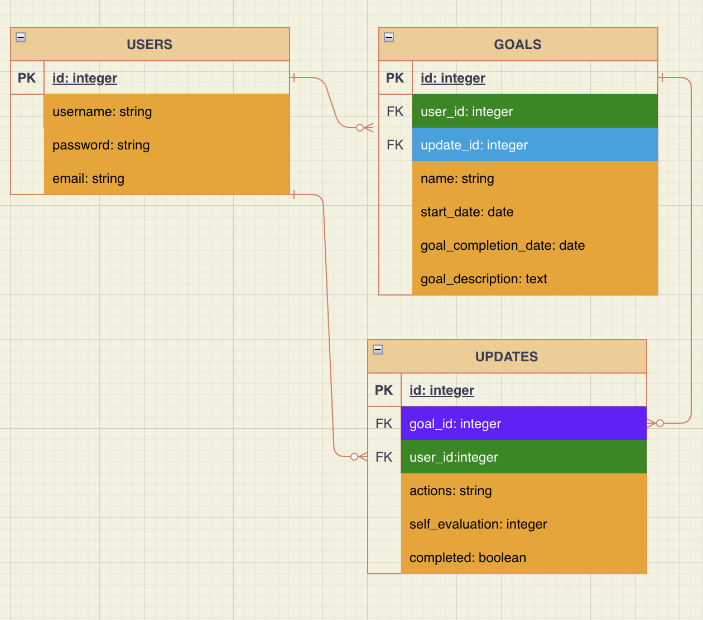

# The Dream Achiever

* Heroku Link: https://goal-setter-api.herokuapp.com/
* Endpoints: users, goals, updates

Technologies:
* Ruby with Ruby on Rails with PostgreSQL
* Bcrypt
* JWT
* rack-cors

Utilized Ruby on Rails API with JWT Auth Tutorial by Alex Merced
https://tuts.alexmercedcoder.com/2020/ruby-tut/

Future Improvements:
Rebuild for models to reflect the SMART goals model.
- Specific
- Measurable
- Achievable
- Relevant
- Time-Bound

Challenges:
I tried to add authentication and authorization after I had already build my API with the relational models. I had to restart the backend and start with authorization to get my entity relationships to work again.

Heroku deploy issues. Possible reason related to above problem of change gitHub repos within the same heroku app. I deleted heroku app and rebuilt and problem ceased.

